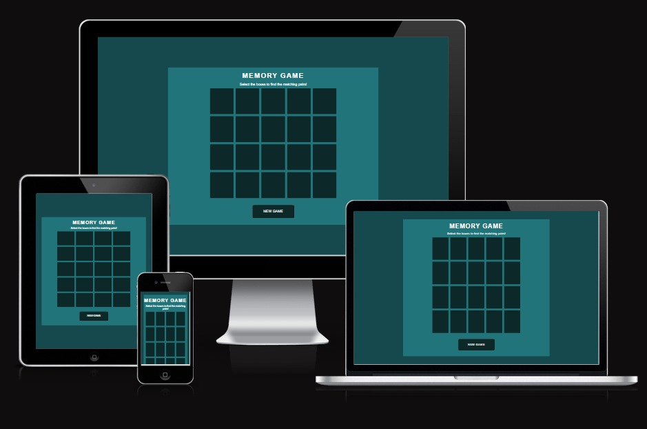
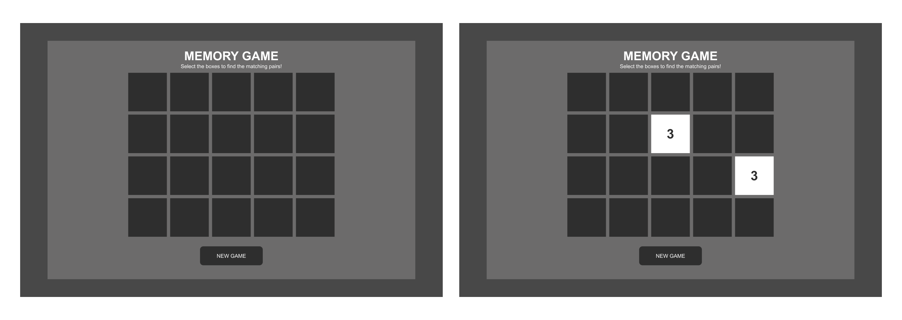
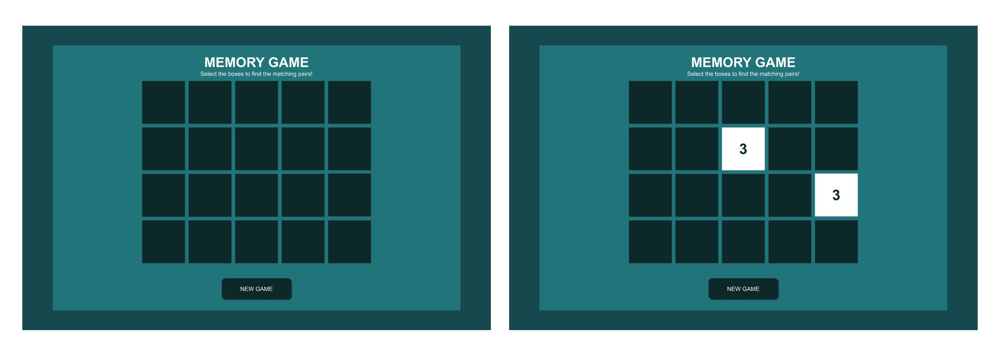
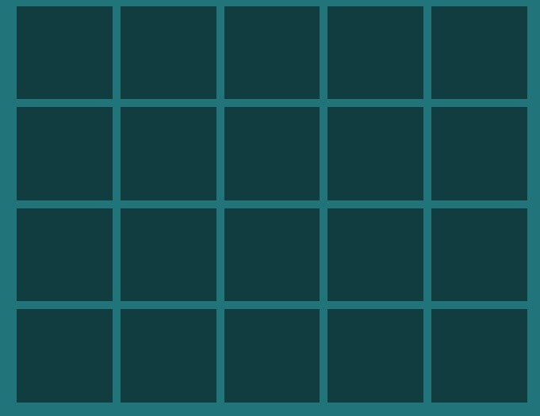
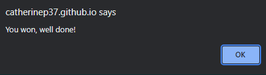
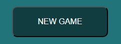
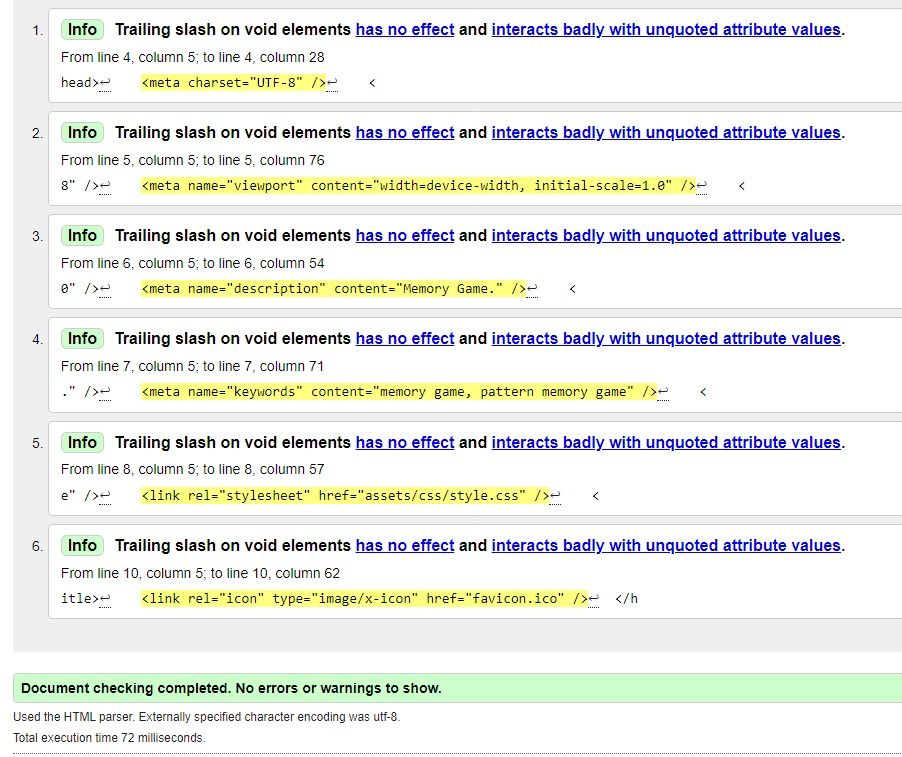
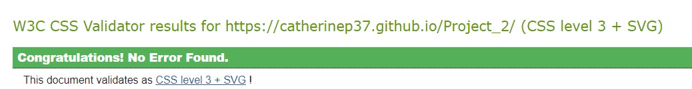
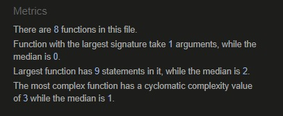
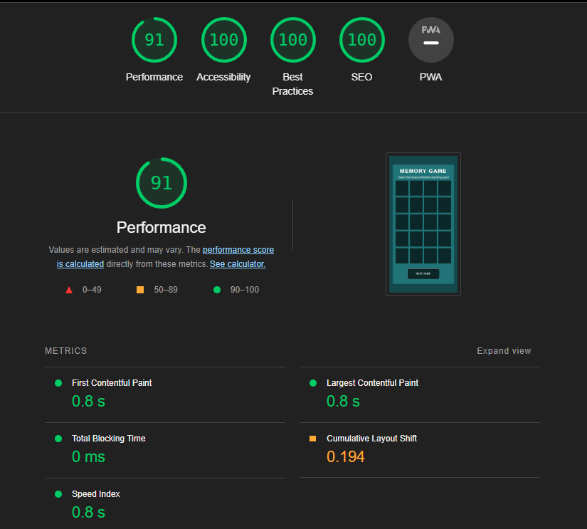

# Memory Game

This memory game is a simple game to help train short-term memory. It consists of a grid with blank coloured boxes. The number of the box is shown when the player selects the box. The number remains shown until the player selects the next box. If the numbers are a match they remain shown. However if the numbers are not a match they are hidden again.

## Table of contents

- [MVP](#mvp)
- [User research](#user-research)
- [User stories](#user-stories)
- [Low fidelity wireframes](#low-fidelity-wireframes)
- [High fidelity wireframes](#high-fidelity-wireframes)
- [Interactive Figma prototype](#interactive-figma-prototype)
- [Features](#features)
- [Build](#build)   
- [Testing](#testing)
- [Bugs](#bugs)   
- [Deployment](#deployment)
- [Credits](#credits)

## MVP

The following must be included in the project:

- Title
- Description
- Grid
- Clickable boxes
- Numbers
- New game button

## User research

### Who are the users?

- People who want to improve their short-term memory
- People who enjoy playing simple computer games

### User research goals

- Understand user goals when playing computer games
- Understand user pain points when playing computer games

### User interviews

For the qualitative research, I interviewed people who are interested in brain training games.

### Surveys

For the quantitative research, I carried out a survey to find out about what players expect from a brain training game.

### Key insights from the user research

- Users would like to have clear instructions for the game
- Users would like the game to have a simple layout that is easy to understand
- Users would like to have a success message after successfully completing the game

## User stories

### User story 1

As a game player, I want clear instructions about how to play the game

### User story 2

As a game player, I want to know when I have found a matching pair of numbers

### User story 3

As a game player, I want a success message letting me know that I have successfully completed the game

### User story 4

As a game player, I want the chance to play the game again after completing it

## Low fidelity wireframes

Here are some low fidelity wireframes:

## High fidelity wireframes

Here are some high fidelity wireframes:

## Interactive Figma prototype

I made a interactive prototype in Figma and carried out usability tests with it. Here is a video of the prototype being tested:

https://github.com/user-attachments/assets/88aa51fe-1042-46c6-bd31-d3b01f5fe614

## Features

### Description

The description says what type of game it is and how to play it.

### Game grid

The game grid contains the boxes that the player selects.

### Message sent when game is won

The message that's given when the game is complete lets the player know that the game is over and that they've won. It also congratulates them for winning the game.

### New game button

The new game button starts the game again from the beginning.

# Build

I built this game with HTML, CSS and JavaScript. Here is the link to the deployed site:

[Deployed Site](https://catherinep37.github.io/Project_2/)

## Testing

The game was tested with the following tools:

- various browsers: Google Chrome, Microsoft Edge, Safari and Firefox

- [HTML Test](https://validator.w3.org/)

I tried to remove the forward slashes from the elements with no closing tag but they were automatically added back. Here is the result of the HTML test:

- [CSS Test](https://jigsaw.w3.org/css-validator/validator)

Here is the result of the CSS test:

- [Javascript test](https://jshint.com/)

Here is the result of the JavaScript test:

- Lighthouse in Google devtools

## Bugs

This project had many bugs throughout its development. It took a long time and lots of trial and error to get the game working properly. Here are examples of the bugs:

- The boxes couldn't be clicked but that problem was solved

- After the first box was clicked the second box couldn't be immediately clicked. This issue was solved by changing the code.
  
There are no current bugs in the code.

## Deployment

To deploy the site, I went to the settings tab of my GitHub repo and selected pages.

I made sure that the source was set to 'Deploy from Branch', the main branch was selected and the folder was set to / (root). Then I clicked save and waited for
the build to finish. Finally I clicked on 'github-pages'.

## Credits

I took inspiration from the following projects:

[Marina Ferreira's memory game](https://marina-ferreira.github.io/tutorials/js/memory-game/)

[Aldo Hadinata's memory game](https://github.com/4ldoHadinata/memory-game-js)
